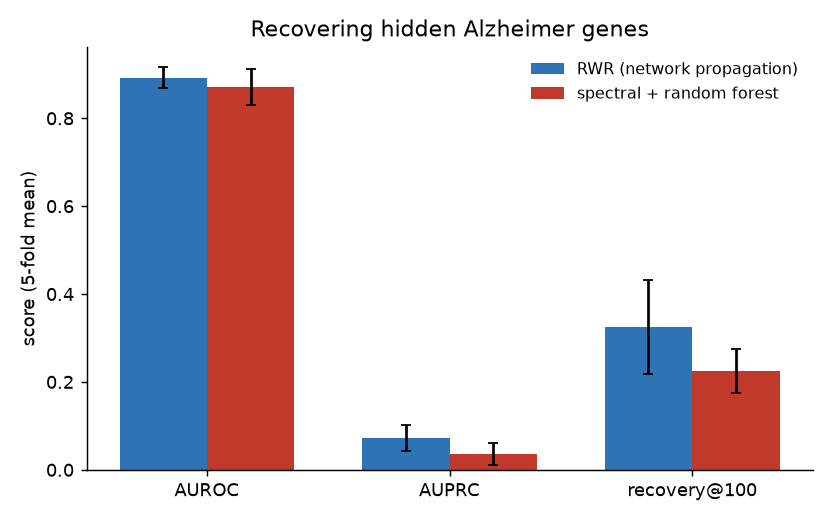
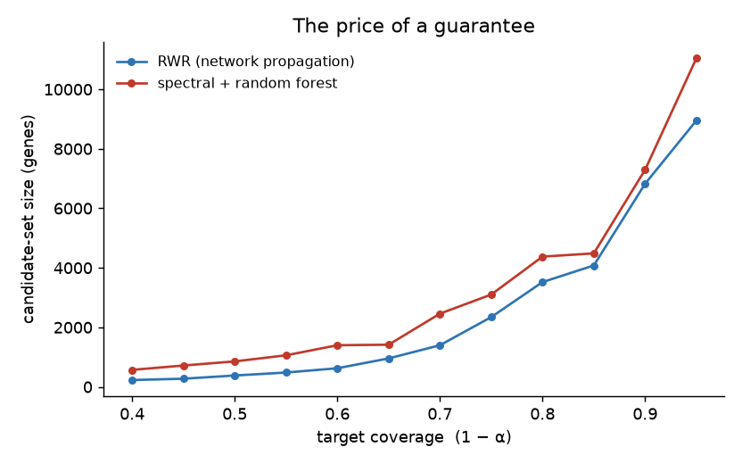
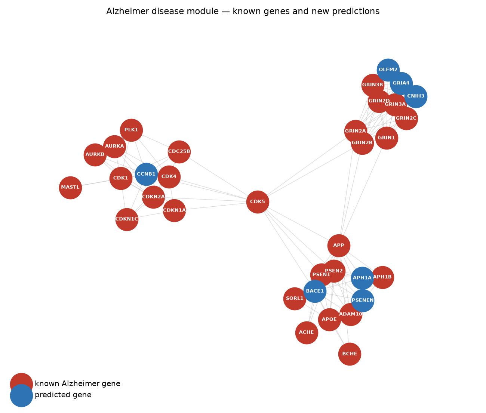

# Alzheimer disease-gene discovery on the protein interaction network

[](LICENSE)
[](https://github.com/laurapiro17/disease-gene-network-prediction/actions/workflows/ci.yml)
[](https://www.python.org/)

Genes that cause the same disease tend to sit close together in the web of
protein-protein interactions. So if you hand a model a handful of **known**
Alzheimer genes and the wiring diagram of the cell, can it point at the genes you
*didn't* give it? And — the question that decides whether any of this reaches a
bench — **when it hands you a shortlist, what is that list actually worth?**

Everything runs on a laptop CPU in under a minute. No GPU, no account, no API
key: the STRING interactome streams in on first run and the Alzheimer gene list
comes live from Open Targets.

## What's inside

The graph is the human **STRING v12** network restricted to high-confidence
links — **15,882 genes, 236,712 interactions**. The **80 seed genes** are every
target Open Targets associates with Alzheimer disease at a score ≥ 0.5. The test
is honest by construction: hide a fifth of the seeds, rank all 15,882 genes from
the rest, and see whether the hidden ones climb back to the top.

| Piece | File | What it does |
|-------|------|--------------|
| Data | [`src/data.py`](src/data.py) | STRING links + Open Targets seeds → one connected, weighted gene graph |
| Propagation | [`src/propagation.py`](src/propagation.py) | random walk with restart — the network-medicine workhorse, no parameters fit from labels |
| Learned model | [`src/embedding.py`](src/embedding.py) | spectral graph embedding → random forest, a genuinely trained alternative |
| Uncertainty | [`src/conformal.py`](src/conformal.py) | split-conformal threshold → a candidate set with a coverage guarantee |
| Experiment | [`src/experiment.py`](src/experiment.py) | 5-fold seed recovery, both models on the same folds, then conformal calibration |
| Figures | [`src/figures.py`](src/figures.py) | the three plots below |

## Does the fancy model beat the old one?

No — and that is the interesting part. Random-walk propagation, which fits
nothing and just lets the known genes diffuse through the graph, edges out the
trained spectral model on every metric.

| model | AUROC | AUPRC | recovery@100 |
|-------|:-----:|:-----:|:------------:|
| **RWR (network propagation)** | **0.892 ± 0.024** | **0.073 ± 0.030** | **0.325 ± 0.108** |
| spectral embedding + random forest | 0.871 ± 0.041 | 0.036 ± 0.025 | 0.225 ± 0.050 |

`recovery@100` is the fraction of hidden Alzheimer genes that land in the top 100
of all 15,882 — propagation pulls back **a third of them**. The learned model is
a real contender, not a strawman, but the lesson is the one that keeps recurring:
a global embedding smears out exactly the local neighbourhood signal that
disease-gene discovery lives on.



## The price of a guarantee

A ranking is not a decision. Split-conformal prediction turns the scores into a
**set** of candidate genes built to contain a genuine disease gene with
probability ≥ 1 − α, calibrated on held-out known genes and assuming nothing
about how the scores are distributed.

The guarantee holds — at a 90% target the set covers **92%** of unseen Alzheimer
genes. But honesty cuts both ways: to keep that promise the set has to be **large**
(~7,000 genes), because the disease signal in the network is diffuse. Demand more
coverage and the set grows fast. That curve *is* the result — a calibrated way of
admitting how much the network alone can and cannot pin down.



## What it actually finds

Retrained on all 80 seeds, the top genes the network nominates — none of them in
the seed set — are not noise. **BACE1**, the β-secretase that makes the first cut
in amyloid processing, ranks **second** overall. Close behind come **PSENEN**
(#5), **APH1A** (#15) and **NCSTN** (#22): together with the seed genes
*PSEN1/PSEN2* they are the four subunits of **γ-secretase**, the complex that
makes the second cut to release amyloid-β. The model rebuilds the
amyloid-processing machine from the pieces it was given.

The rest of the shortlist splits cleanly into known Alzheimer biology: a block of
mitochondrial complex-I genes (*NDUFS3/7/8, NDUFA2/13…*) and a glutamate-receptor
block (*GRIA2/4, GRIN subunits, CNIH3*).



*Known Alzheimer genes (red) and the top new predictions (blue), drawn on their
shared STRING interactions. The predictions fall inside the known modules — which
is exactly what guilt-by-association should do.*

## Run it

```bash
make install        # python3.13 venv + dependencies
make test           # fast synthetic-graph tests, no download
make all            # reproduce metrics.json (streams STRING on first run) + figures
```

First run downloads ~79 MB from STRING and a few hundred genes from Open Targets,
then caches them under `data/`; after that the whole experiment is a few seconds.
Numbers land in [`results/metrics.json`](results/metrics.json).

## Data & methods

- **STRING v12.0**, human (taxon 9606), combined score ≥ 700 — Szklarczyk et al.,
  *Nucleic Acids Research* 2023. <https://string-db.org>
- **Open Targets Platform** association scores — Ochoa et al., *Nucleic Acids
  Research* 2023. <https://platform.opentargets.org>
- **Random walk with restart** for disease-gene prioritisation — Köhler et al.,
  *Walking the interactome for prioritization of candidate disease genes*,
  Am. J. Hum. Genet. 2008.
- **Conformal prediction** — Angelopoulos & Bates, *A Gentle Introduction to
  Conformal Prediction and Distribution-Free Uncertainty Quantification*, 2023.

Seeds are an automated association list, not a curated causal-gene panel; the
"discoveries" are hypotheses for follow-up, not claims of causation.

## Related

Part of a series on uncertainty in biomedical models:
[oasis-dementia-uncertainty](https://github.com/laurapiro17/oasis-dementia-uncertainty)
(is a dementia classifier's confidence calibrated?) and
[eeg-motor-imagery](https://github.com/laurapiro17/eeg-motor-imagery)
(does a deep net read the brain or the noise?).
